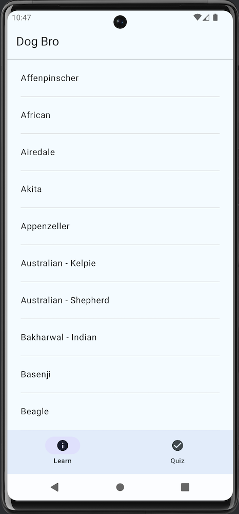
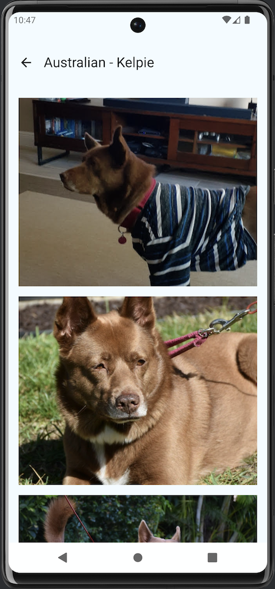
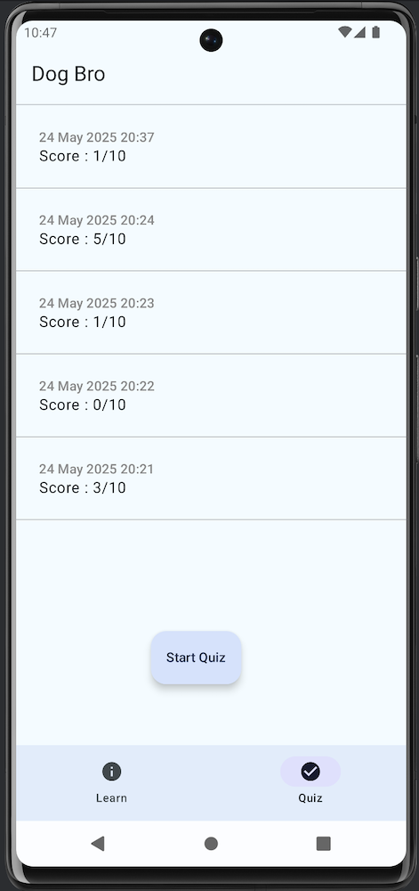
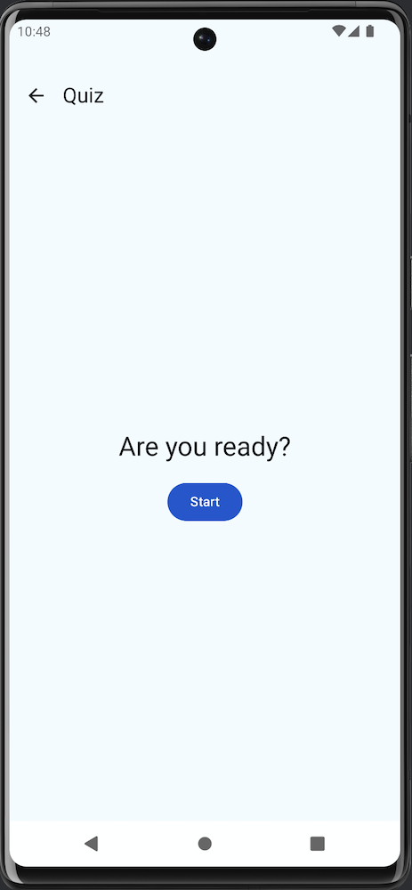
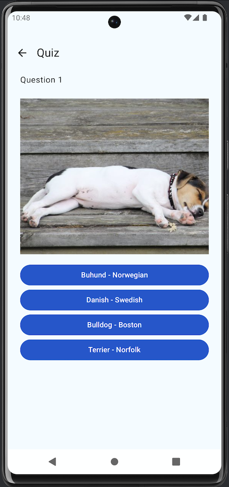
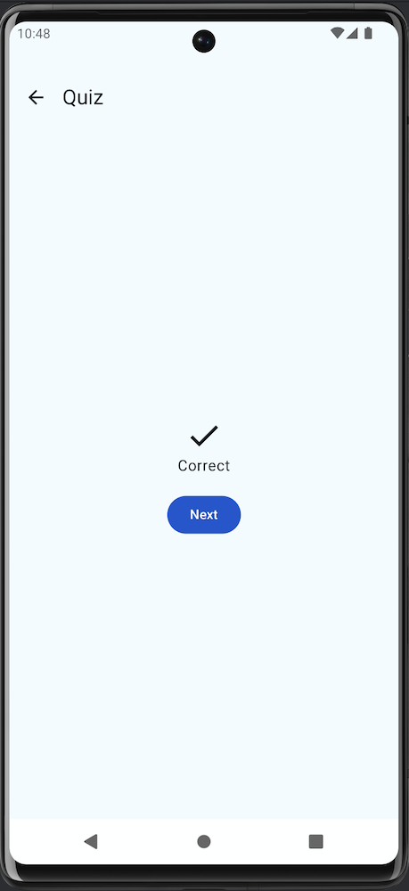
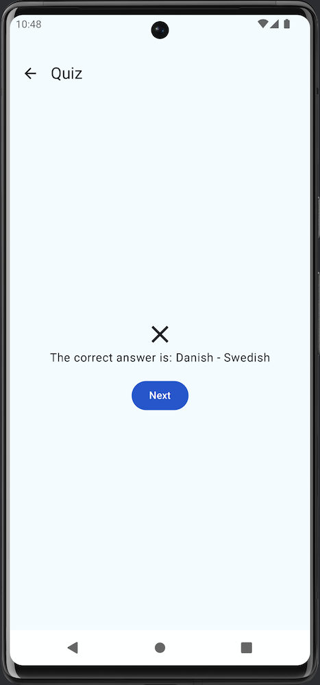
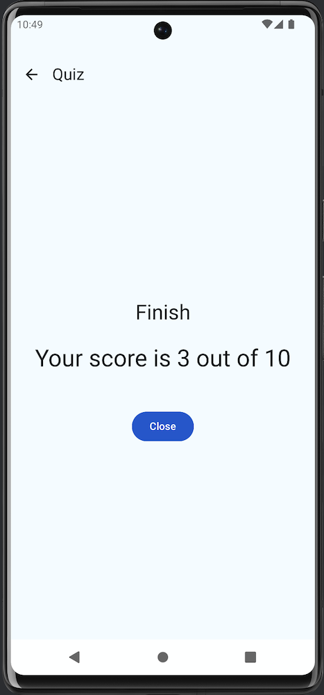

## Dog Bro

Help you know more about dog breeds and practice. Know the image of each breed and also review your learning progress.

---

### Features

|  |  |  |  |
|:------------------------:|:--------------------------:|:--------------------------:|:------------------------:|
| List of all breeds       | Image of selected breed    | Quiz history               | Start Quiz               |

|  |  |  |  |
|:------------------------:|:--------------------------:|:--------------------------:|:------------------------:|
| Question                 | Answer Correct             | Answer Incorrect           | Final Result             |

---

### Support
- Offline mode for breed list
- Loading view for network/local operations
- Error page with reload option
- Empty state page

### Tech Stack
- **Principle:** Clean Architecture
- **Architecture:** MVVM
- **Dependency Injection:** Hilt
- **Concurrency:** Flow
- **Network:** Retrofit
- **Local Storage:** Room
- **UI:** Jetpack Compose
- **Testing:** MockK